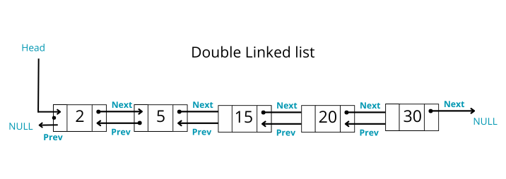
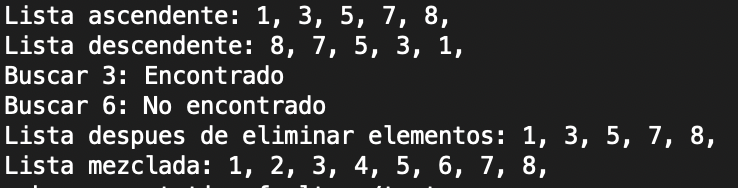

# Double Linked List

This repository contains an academic implementation of a **Double Linked List** in C++ using templates. It was developed as part of a learning project to explore data structures in depth and to understand memory management, traversal operations, and exception handling.

---



## Description

The main class, `ListaDoble2<T>`, is a generic (templated) double-linked list implementation written in modern C++. It provides comprehensive operations to manage and manipulate the list, including insertion, deletion, search, and more.

### Key Features:

- Insert elements at the **beginning**, **end**, or at a specific **position**.
- Remove elements from the **start**, **end**, or a given **position**.
- Search for elements by **value** or **position**.
- Get the **first**, **last**, or element at a specific **position**.
- Modify element values by position.
- **Print** the list in forward or reverse order.
- **Transfer** elements from another list (entire list or a specific range).
- Remove **duplicates**, **all occurrences** of a value, or **elements matching a condition**.
- Sort the list in **ascending order**.
- Custom exceptions for empty list and out-of-range access.

---

## Files Included

- `ListaDoble2.hpp` – Header file with the class definition and documentation.
- `ListaDoble2.tpp` – Implementation file for the template methods.
- `main.cpp` – Demonstration file with usage examples.

---

## Example Use 




---

## Run and compile

- Clone the repository:

```bash
git clone https://github.com/ana-chenoweth/double-linked-list.git
cd double-linked-list
```

- Compile with any C++ compiler:

```bash
clang++ -std=c++17 -Wall -o test main.cpp
./test
```

- For Windows users, you can run the executable:
```
double-linked-list.exe
```


Make sure both `ListaDoble2.hpp` and `ListaDoble2.tpp` are in the same directory.

---

## Contributions

This is an academic project and not intended for production, but contributions for improvement, feedback, and educational enhancements are welcome.

Feel free to fork the repository and submit a pull request.

---

## License

This project is licensed under the MIT License. See the [LICENSE](LICENSE) file for more details.

---

Developed by Ana Laura Chenoweth Galaz and Georgina Salcido Valenzuela · March 2024

